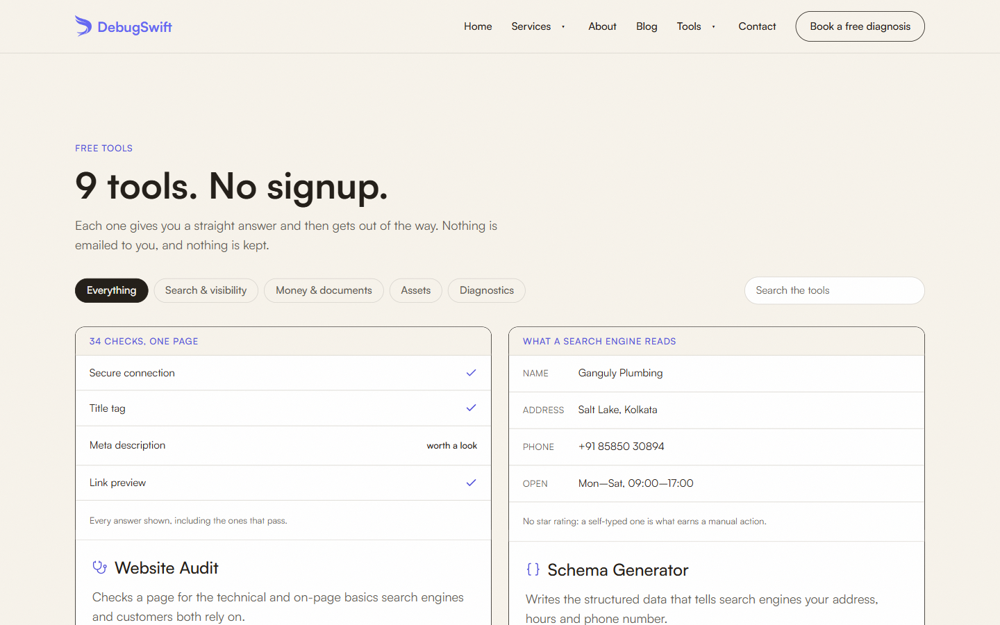
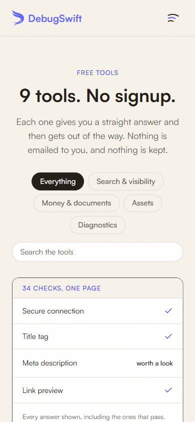

# DebugSwift Free Tools

**Live:** https://debugswift.com/tools

Nine free tools for small businesses. No sign-up, and the result is never behind an email form. Seven of the nine run entirely in your browser.

| Tool | What it does |
|---|---|
| [Website Audit](https://debugswift.com/tools/website-audit) | Checks a page for the technical and on-page basics search engines and customers both rely on. |
| [Schema Generator](https://debugswift.com/tools/schema-generator) | Writes the structured data that tells search engines your address, hours and phone number. |
| [Email Deliverability Check](https://debugswift.com/tools/email-deliverability) | Checks the four DNS records that decide whether your email reaches an inbox or a spam folder. |
| [Meta & Headline Generator](https://debugswift.com/tools/meta-generator) | Shows exactly where Google cuts your title tag, measured in pixels, not characters. |
| [Quote & Invoice Generator](https://debugswift.com/tools/quote-generator) | Fills a clean, printable quote or invoice and saves it as a PDF from your browser. |
| [Brand Kit Generator](https://debugswift.com/tools/brand-kit) | Turns one colour into a ten-step palette with contrast measured on every step, plus a type scale. |
| [QR Code Generator](https://debugswift.com/tools/qr-generator) | Makes a vector QR code for your Wi-Fi, a contact card, a link or a chat, with no redirect that can expire. |
| [Image Compressor](https://debugswift.com/tools/image-compressor) | Shrinks photos on your own device so a page stops waiting on them. Nothing is uploaded. |
| [Project Scoper](https://debugswift.com/tools/project-scoper) | Turns a vague idea into a written brief, so three quotes are finally comparable. |

## Documentation

- **[The tools, one by one](docs/guide.md):** what each checks, what it can't tell you, and what happens to what you type
- **[Changelog](CHANGELOG.md):** what changed, and when

## Found a problem, or want a tool?

[Open an issue](../../issues/new/choose): report a wrong result, or suggest a tool you wish existed.

## Source code

The tools' source is private. This repository is their public home: documentation, changelog and issue tracker.

Built by [DebugSwift](https://debugswift.com).
