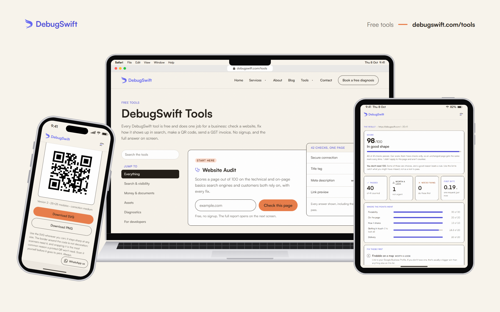

# DebugSwift Tools

**Live:** https://debugswift.com/tools

Free tools for small businesses, from [DebugSwift](https://debugswift.com). No sign-up, and the result is never behind an email form. Each tool says where it runs: most work entirely in your browser, so nothing you type is sent anywhere.

Not to be confused with the open-source iOS debugging library also called DebugSwift, which is an unrelated project.

**Start here: [Website Audit](https://debugswift.com/tools/website-audit).** Paste an address and get a score out of 100 and every fix.

## Search & visibility

| Tool | What it does | Runs |
|---|---|---|
| [Website Audit](https://debugswift.com/tools/website-audit) | Scores a page out of 100 on the technical and on-page basics search engines and customers both rely on, with every fix. | Our server |
| [Digital Footprint Check](https://debugswift.com/tools/digital-footprint) | Shows how findable and believable your business is online: your site, your profiles, search, maps and listings, scored out of 100. | Our server |
| [Schema Generator](https://debugswift.com/tools/schema-generator) | Writes the structured data that tells search engines your address, hours and phone number. | Your browser |
| [Meta & Headline Generator](https://debugswift.com/tools/meta-generator) | Shows exactly where Google cuts your title tag, measured in pixels, not characters. | Your browser |

## Money & documents

| Tool | What it does | Runs |
|---|---|---|
| [Quote & Invoice Generator](https://debugswift.com/tools/quote-generator) | Makes quotes and GST invoices with your logo and a UPI pay QR, keeps a list of them, and saves PDFs from your browser. | Your browser |
| [Project Brief Builder](https://debugswift.com/tools/project-scoper) | Turns a vague idea into a brief agencies can quote on like-for-like, then lines the quotes up side by side. | Your browser |

## Assets

| Tool | What it does | Runs |
|---|---|---|
| [Brand Kit Generator](https://debugswift.com/tools/brand-kit) | Turns one colour or your logo into palettes, themes, font pairings and a printable brand sheet, with contrast measured on everything. | Your browser |
| [QR Code Generator](https://debugswift.com/tools/qr-generator) | Makes a vector QR code for your Wi-Fi, a contact card, a link or a chat, with no redirect that can expire. | Your browser |
| [Image Compressor](https://debugswift.com/tools/image-compressor) | Shrinks photos on your own device so a page stops waiting on them. Nothing is uploaded. | Your browser |

## Diagnostics

| Tool | What it does | Runs |
|---|---|---|
| [Email Deliverability Check](https://debugswift.com/tools/email-deliverability) | Checks the four DNS records that decide whether your email reaches an inbox or a spam folder. | Our server |

## For developers

| Tool | What it does | Runs |
|---|---|---|
| [Fallback Font Check](https://debugswift.com/tools/fallback-font-check) ([source](https://github.com/DebugSwiftHQ/fallback-font-check)) | Measures your fallback font against your webfont on real pages and prints the size-adjust that stops text re-wrapping. | Your machine (open source CLI) |

"Our server" means our server fetches something public (a web page, DNS records) and sends the result back. Nothing is stored.

## Documentation

- **[The tools, one by one](docs/guide.md):** what each checks, what it can't tell you, and what happens to what you type
- **[Changelog](CHANGELOG.md):** what changed, and when

## Found a problem, or want a tool?

[Open an issue](../../issues/new/choose): report a wrong result, or suggest a tool you wish existed.

## Source code

The tools' source is private. This repository is their public home: documentation, changelog and issue tracker. The exception is [fallback-font-check](https://github.com/DebugSwiftHQ/fallback-font-check), which is MIT licensed.

Built by [DebugSwift](https://debugswift.com).
